# Projekt : Terminál pre odomykanie / zamykanie dverí pomocou PIN kódu
### Členovia tímu
[Baránek Michal](https://github.com/michalizn/Digital-electronics-1)

[Bartoň Jan](https://github.com/xbarto0c/Digital-electronics-1)

[Bařina Tadeáš](https://github.com/Tadeas155/Digital-electronics1)

[Bekeč Alexander](https://github.com/alexander-bekec/Digital-electronics-1)

Odkaz na zložku s projektom: 
[https://github.com/xbarto0c/Digital-electronics-1/tree/main/Labs/Project_code_lock](https://github.com/xbarto0c/Digital-electronics-1/tree/main/Labs/Project_code_lock)

### Ciele projektu
Cieľom projektu bolo navrhnúť terminál pre odomykanie dverí pomocou štvormiestneho PIN kódu. Projekt mal obsahovať tlačidlá pre zadávanie PIN kódu, štyri sedemsegmentové dipleje pre zobrazenie hesla a relé pre ovladanie zámku.

## Popis hardvéru
Základným hardvérom projektu je doska Arty A7-35T. Nakoľko táto doska neobsahuje niektoré súčasti, ktoré boli potrebné pri návrhu projektu, bola navrhnutá periféria - DPS obsahujúca potrebné súčasti (sedemsegmentový dispej, tlačidlá pre zadávanie PIN kódu s CR článkami pre vytvorenie pulzu pri stlačení tlačidla, piezo bzučiak, relé...):

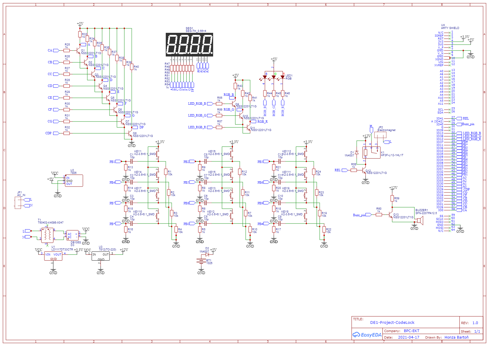
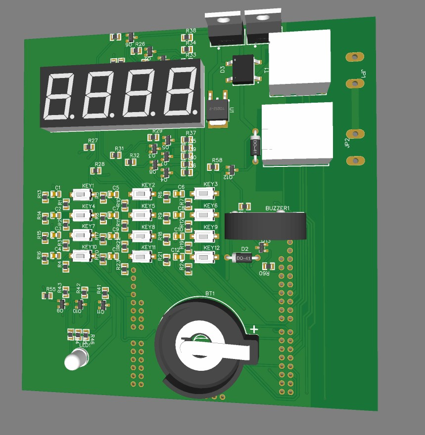
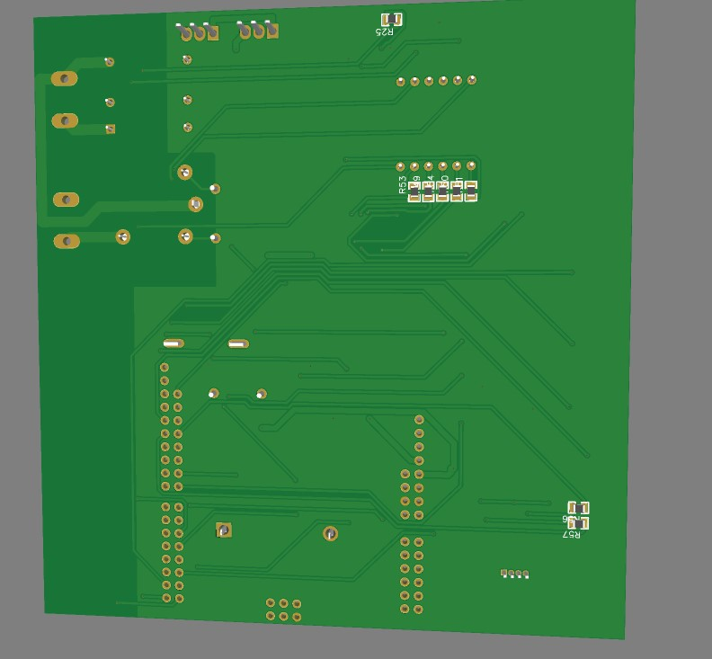

## Popis a simulácia VHDL modulov
**Upozornenie: Všetky moduly majú upravené pomery a trvania pre účely simulácie, preto simulácie ukazujú hlavný princíp a nie presný beh projektu a modulov.**

### clock_divider
Odkaz na zdrojový kód: [https://github.com/xbarto0c/Digital-electronics-1/blob/main/Labs/Project_code_lock/DE1_project_code_lock/DE1_project_code_lock.srcs/sources_1/new/clock_divider.vhd](https://github.com/xbarto0c/Digital-electronics-1/blob/main/Labs/Project_code_lock/DE1_project_code_lock/DE1_project_code_lock.srcs/sources_1/new/clock_divider.vhd)

Popis: Modul clock_divider delí frekvenciu hodinového signálu, teda vytvára signál s menšou frekvenciou ako samotný hodinový signál. 

Simulácia:
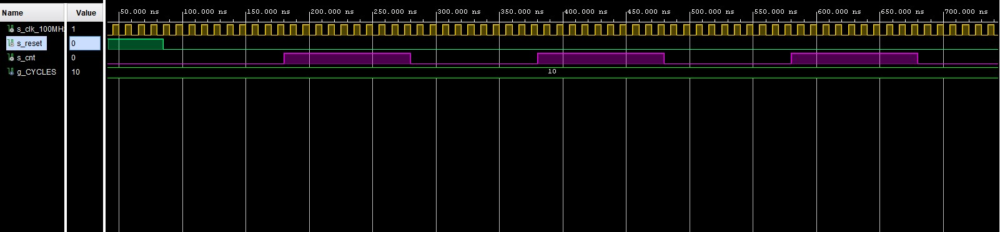

### clock_enable
Odkaz na zdrojový kód: [https://github.com/xbarto0c/Digital-electronics-1/blob/main/Labs/Project_code_lock/DE1_project_code_lock/DE1_project_code_lock.srcs/sources_1/new/clock_enable.vhd](https://github.com/xbarto0c/Digital-electronics-1/blob/main/Labs/Project_code_lock/DE1_project_code_lock/DE1_project_code_lock.srcs/sources_1/new/clock_enable.vhd)

Popis: Modul clock_enable vytvára pulz po priebehu určitého počtu periód hodinového signálu.

Simulácia:
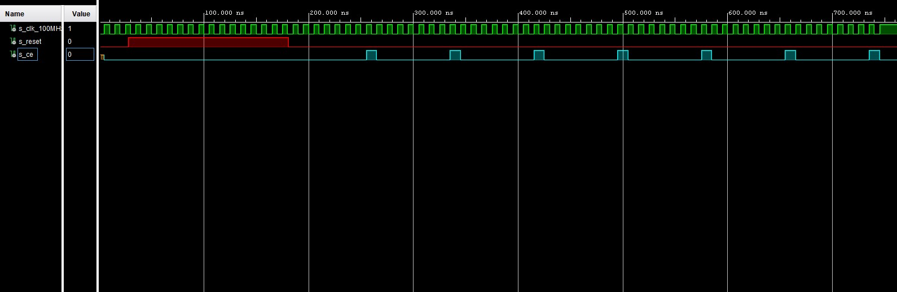

### cnt_up_down
Odkaz na zdrojový kód: [https://github.com/xbarto0c/Digital-electronics-1/blob/main/Labs/Project_code_lock/DE1_project_code_lock/DE1_project_code_lock.srcs/sources_1/new/cnt_up_down.vhd](https://github.com/xbarto0c/Digital-electronics-1/blob/main/Labs/Project_code_lock/DE1_project_code_lock/DE1_project_code_lock.srcs/sources_1/new/cnt_up_down.vhd)

Popis: Modul cnt_up_down je up/down bitový čítač.

Simulácia:
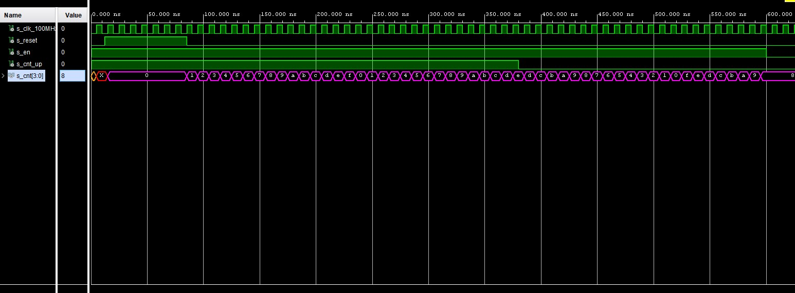

### display_driver_7seg_4digits
Odkaz na zdrojový kód: [https://github.com/xbarto0c/Digital-electronics-1/blob/main/Labs/Project_code_lock/DE1_project_code_lock/DE1_project_code_lock.srcs/sources_1/new/display_driver7seg_digit.vhd](https://github.com/xbarto0c/Digital-electronics-1/blob/main/Labs/Project_code_lock/DE1_project_code_lock/DE1_project_code_lock.srcs/sources_1/new/display_driver7seg_digit.vhd)

Popis: Modul display_driver_7seg_4digits je ovladač štvormiestneho sedemsegmentového dipleja. Vyberá spravnú pozíciu čísla a časovanie výstupov. 

Simulácia: 
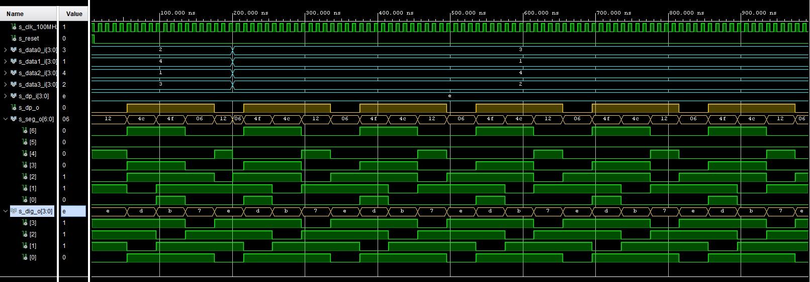

### door_lock_core
Odkaz na zdrojový kód: [https://github.com/xbarto0c/Digital-electronics-1/blob/main/Labs/Project_code_lock/DE1_project_code_lock/DE1_project_code_lock.srcs/sources_1/new/door_lock_core.vhd](https://github.com/xbarto0c/Digital-electronics-1/blob/main/Labs/Project_code_lock/DE1_project_code_lock/DE1_project_code_lock.srcs/sources_1/new/door_lock_core.vhd)

Popis: Modul door_lock_core je v podstate hlavným modulom celého projektu. rieší spracovanie PIN kódu, jeho kontrolu, zmenu na nový PIN kód, spúšťanie a kontrolu RGB diódy, piezo bzučiaka, spínanie relé. Jeho jadro tvorí stavový automat:
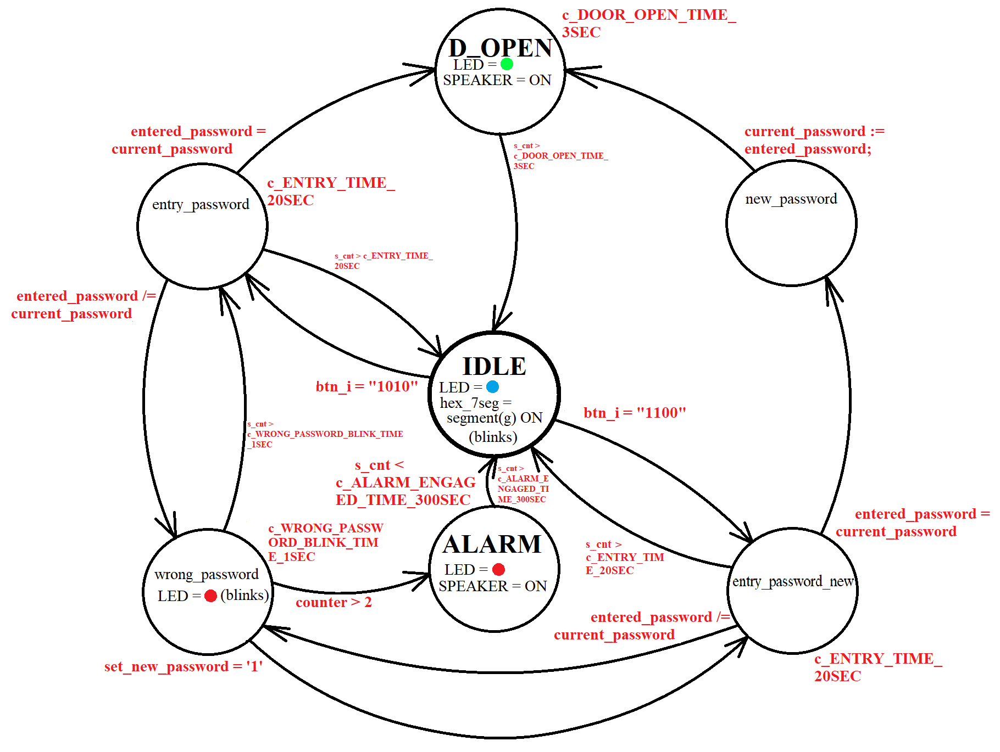

Simulácia:
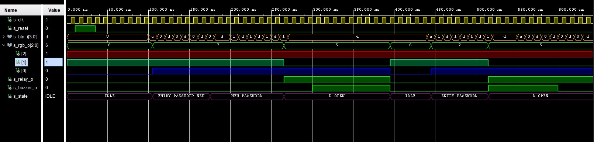
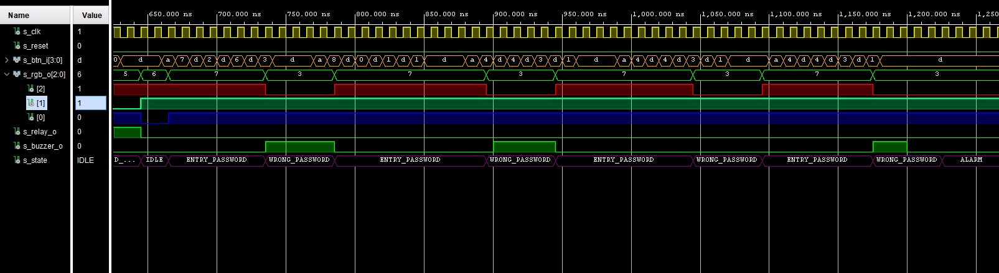
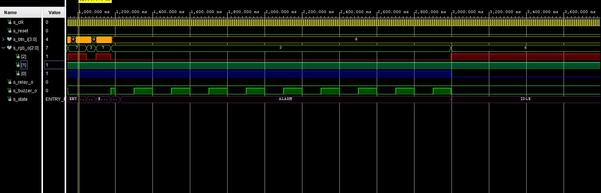
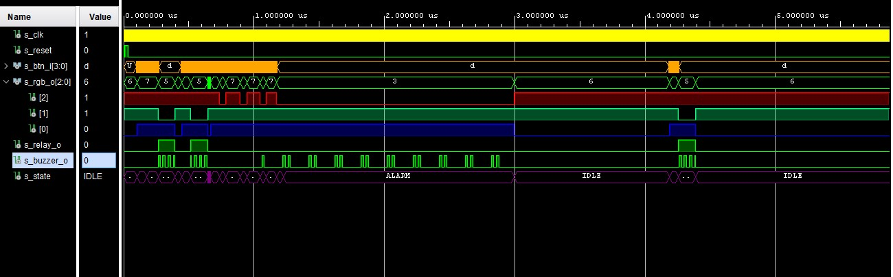

### hex_7_seg
Odkaz na zdrojový kód: [https://github.com/xbarto0c/Digital-electronics-1/blob/main/Labs/Project_code_lock/DE1_project_code_lock/DE1_project_code_lock.srcs/sources_1/new/hex_7_seg.vhd](https://github.com/xbarto0c/Digital-electronics-1/blob/main/Labs/Project_code_lock/DE1_project_code_lock/DE1_project_code_lock.srcs/sources_1/new/hex_7_seg.vhd)

Popis: Modul hex_7_seg je dekodérom štvorbitového výstupu na výstup pre ovladanie sedemsegmentového displeja. Pre účely použitia v tomto projekte bol výstup pre A zmenený na - (pomĺčku) a B na prázdny displej.

Simulácia:
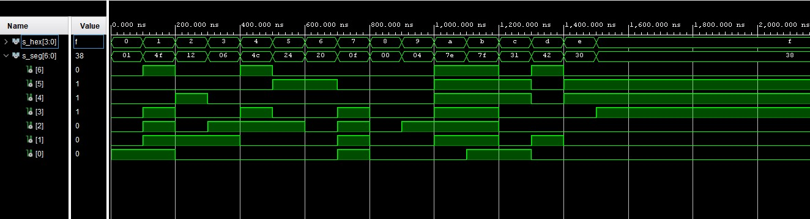

### keyboard_decoder
Odkaz na zdrojový kód: [https://github.com/xbarto0c/Digital-electronics-1/blob/main/Labs/Project_code_lock/DE1_project_code_lock/DE1_project_code_lock.srcs/sources_1/new/keyboard_decoder.vhd](https://github.com/xbarto0c/Digital-electronics-1/blob/main/Labs/Project_code_lock/DE1_project_code_lock/DE1_project_code_lock.srcs/sources_1/new/keyboard_decoder.vhd)

Popis: Modul keyboard_decoder prijíma výstupy jednotlivých tlačidiel, ktoré následne spojí do jedného signálu, ktorý dekóduje na štvorbitový reťazec pre modul door_lock_core. Modul má "zabudovanú" ochranu proti stlačeniu dvoch tlačidiel naraz.

Simulácia:
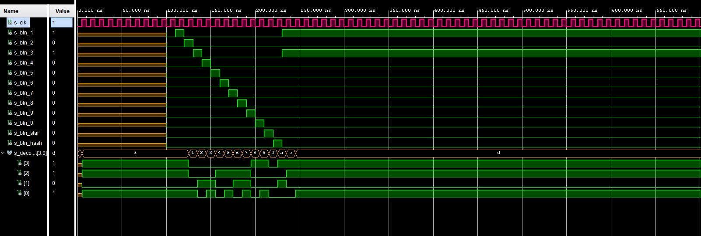

### mux_2to1
Odkaz na zdrojový kód: [https://github.com/xbarto0c/Digital-electronics-1/blob/main/Labs/Project_code_lock/DE1_project_code_lock/DE1_project_code_lock.srcs/sources_1/new/mux_2to1.vhd](https://github.com/xbarto0c/Digital-electronics-1/blob/main/Labs/Project_code_lock/DE1_project_code_lock/DE1_project_code_lock.srcs/sources_1/new/mux_2to1.vhd)

Popis: Modul mux_2to1 je multiplexer s dvoma datovými vstupmi (jednobitovými), jedným vstupom rozhodovacím (tiež jednobitový) a jedným výstupom.

Simulácia:
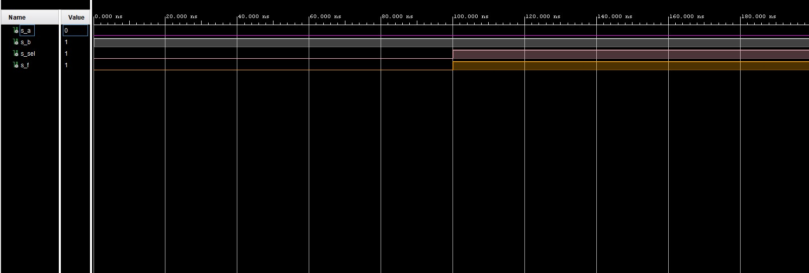

### piezo_driver
Odkaz na zdrojový kód: [https://github.com/xbarto0c/Digital-electronics-1/blob/main/Labs/Project_code_lock/DE1_project_code_lock/DE1_project_code_lock.srcs/sources_1/new/piezo_driver.vhd](https://github.com/xbarto0c/Digital-electronics-1/blob/main/Labs/Project_code_lock/DE1_project_code_lock/DE1_project_code_lock.srcs/sources_1/new/piezo_driver.vhd)

Popis: Modul piezo_driver je ovládač piezo bzučiaka. Generuje obdlžníkový signál s frekvenciou 1000 Hz a zároveň podľa dvojbitového vstupu (mode_i) rozhoduje, či má byť výstup nulový, konštantný tón alebo pípanie (prepínanie medzi stavom vypnutý - konštantný tón)

Simulácia:
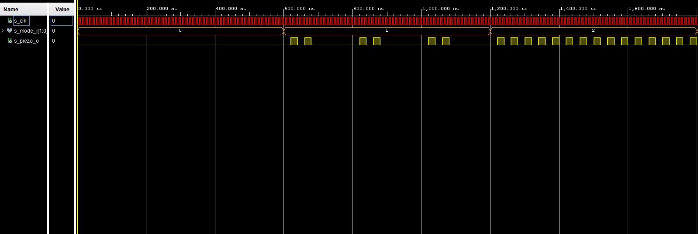

## Popis a simulácia TOP modulu
Odkaz na zdrojový kód: [https://github.com/xbarto0c/Digital-electronics-1/blob/main/Labs/Project_code_lock/DE1_project_code_lock/DE1_project_code_lock.srcs/sources_1/new/top.vhd](https://github.com/xbarto0c/Digital-electronics-1/blob/main/Labs/Project_code_lock/DE1_project_code_lock/DE1_project_code_lock.srcs/sources_1/new/top.vhd)

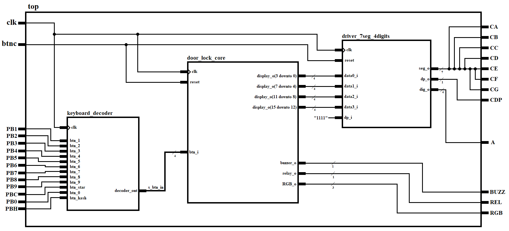

V rámci top modulu sa prijímajú vstupy z periférie (hlavne výstupy tlačidiel) a hodinový signál z hlavnej dosky. Pulzy z tlačidiel sú spracované dekodérom keyboard_decoder na štvorbitový výstup, ktorý je pripojený na vstup modulu door_lock_core, kde sa tento vstup postupne zapisuje na jednotlivé pozície zadávaného hesla, overí sa platnosť a na základe toho sa presúva do požadovaného stavu. Postupným chodom medzi stavami sú určené aj jednotlivé výstupy, ktoré sú pripojené na prislušné výstupy top modulu (RGB LED dióda, piezo bzučiak, relé), prípadne na dekóder a ovladač štvormiestneho sedemsegmentového displeja, ktorého výstup je následne pripojený na výstupy top modulu pre displej. 

Simulácia:
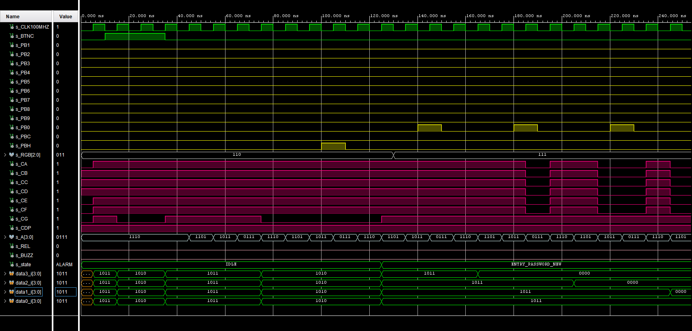
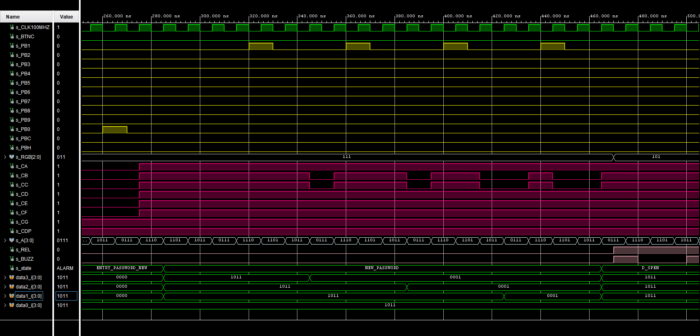
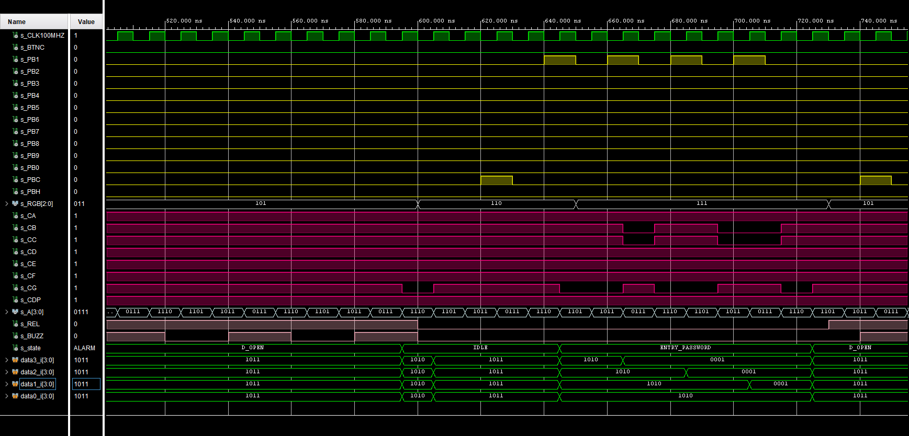
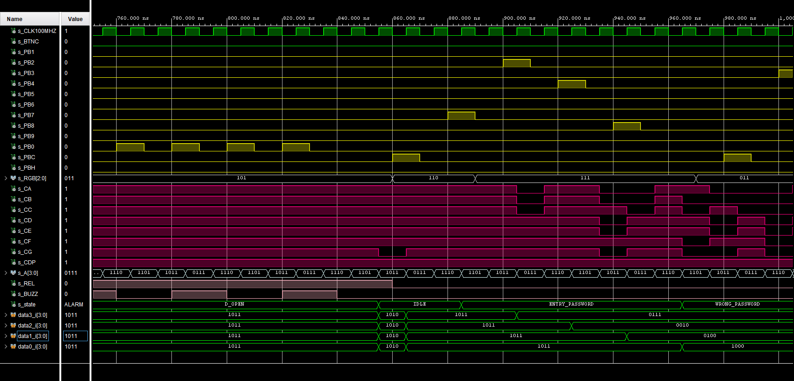
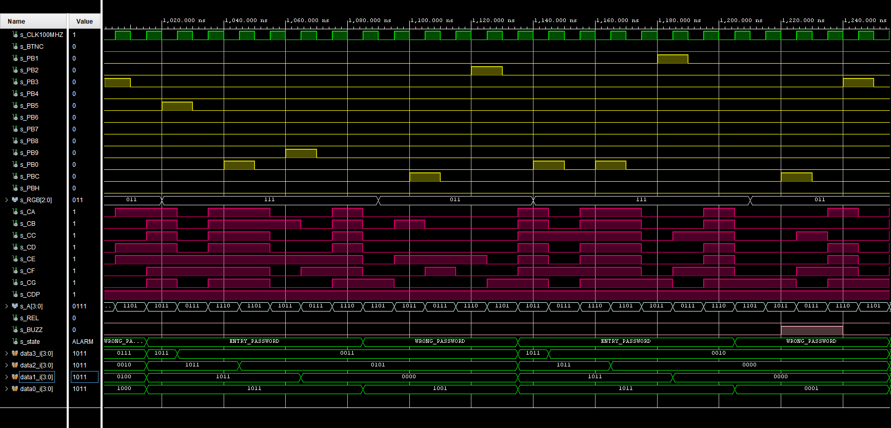
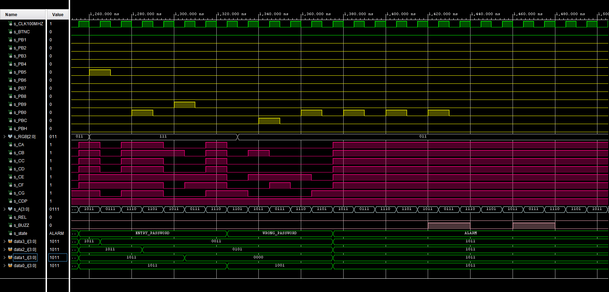
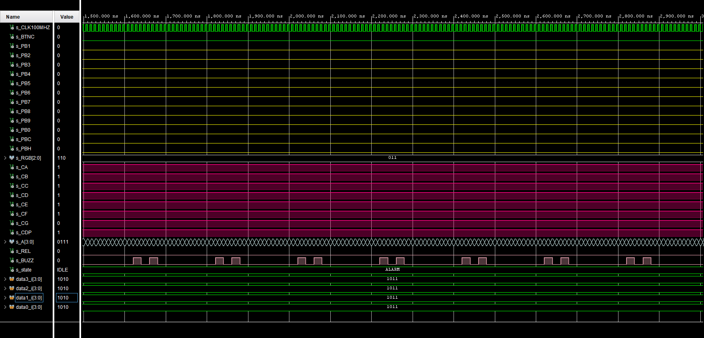
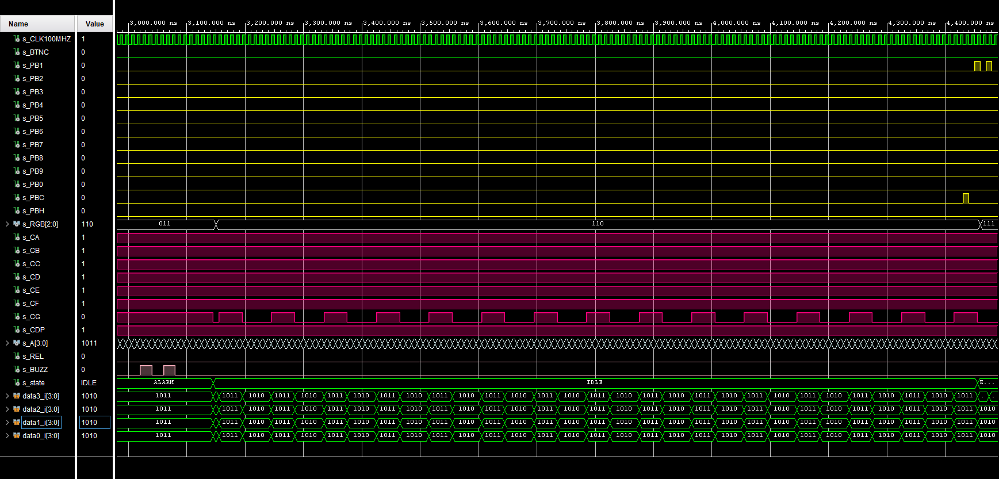

## Video
Link na video: [https://www.youtube.com/watch?v=K0PdgdODcqE](https://www.youtube.com/watch?v=K0PdgdODcqE)

## Referencie
Informácie a nápady boli čerpané prevažne z predošlých počítačových cvičení.

